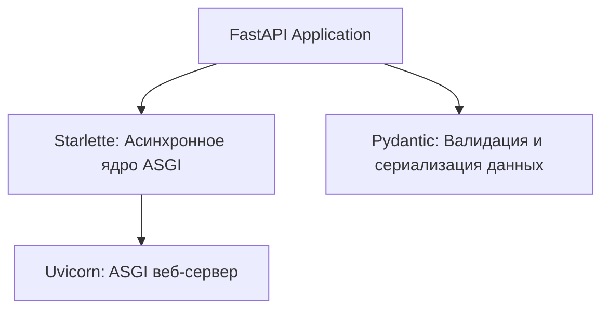

# Архитектура и возможности веб-фреймворка FastAPI

Этот документ представляет собой концептуальный разбор современного асинхронного Python веб-фреймворка **FastAPI**, предназначенный для изучения и интеграции в рабочие процессы команды разработчиков.

---

## 🎯 Введение в FastAPI

**FastAPI** — это высокопроизводительный, легковесный веб-фреймворк для создания HTTP REST API на Python 3.8+, выпущенный в 2018 году Себастьяном Рамиресом (Sebastián Ramírez). Он спроектирован вокруг стандартных подсказок типов (type hints) Python и библиотек **Pydantic** и **Starlette**, обеспечивая максимальную скорость разработки, производительность кода и автоматическую генерацию OpenAPI документации.

---

## 🔌 Основные компоненты (Композиция силы)

FastAPI не изобретает заново базовые механизмы веб-сервера, а объединяет три лучшие технологии в единый согласованный стек:



### 1. Starlette (Асинхронное ядро)
**Starlette** — это легковесный ASGI-инструментарий, отвечающий за маршрутизацию, управление WebSocket-соединениями, жизненный цикл приложения (lifespan events), фоновые задачи (Background Tasks) и базовые механизмы безопасности.

### 2. Pydantic (Валидация данных)
**Pydantic** отвечает за проверку соответствия типов входящих данных (десериализация) и форматирование исходящих данных (сериализация). 
- Автоматически проверяет JSON-тело запросов на соответствие заданным схемам.
- Обеспечивает строгий статический анализ типов в IDE благодаря стандартным аннотациям типов Python.

### 3. Uvicorn (ASGI веб-сервер)
**Uvicorn** — это низкоуровневый веб-сервер, реализующий спецификацию ASGI. Он поддерживает многопроцессорную архитектуру (основной процесс распределяет входящие запросы по пулу воркеров) и обеспечивает сверхбыструю доставку HTTP-пакетов.

---

## ⚡ Ключевые возможности и паттерны проектирования

### 1. Асинхронность (Asynchronous Event Loop)
Благодаря асинхронному дизайну на базе `async/await`, FastAPI эффективно обрабатывает тысячи конкурентных соединений в рамках одного потока, что делает его оптимальным решением для I/O-bound операций (запросы к БД, внешние API, файловый ввод-вывод).

### 2. Внедрение зависимостей (Dependency Injection)
Встроенная система внедрения зависимостей (`Depends`) позволяет легко изолировать бизнес-логику, управлять сессиями баз данных, выполнять авторизацию пользователей и повторно использовать общие модули:

```python
from fastapi import Depends, FastAPI
from db import DbSession

def get_db():
    db = DbSession()
    try:
        yield db
    finally:
        db.close()

@app.post("/items/")
def create_item(name: str, db: DbSession = Depends(get_db)):
    # Сессия базы данных автоматически внедряется и гарантированно закрывается после ответа
    ...
```

### 3. Поддержка WebSockets
Позволяет организовывать постоянное двустороннее соединение (full-duplex) между сервером и клиентом. Это необходимо для живых дашбордов, чатов и многопользовательских систем:
```python
from fastapi import WebSocket

@app.websocket("/ws")
async def websocket_endpoint(websocket: WebSocket):
    await websocket.accept()
    while True:
        data = await websocket.receive_text()
        await websocket.send_text(f"Получено: {data}")
```

### 4. Фоновые задачи (Background Tasks)
Позволяет выполнять тяжелые или некритичные операции (отправка писем, рендеринг изображений, парсинг логов) асинхронно *после* того, как HTTP-ответ уже был успешно отправлен клиенту, что значительно снижает время ожидания пользователя.

---

## 📋 Автогенерация OpenAPI документации

Одной из самых ценных функций FastAPI является мгновенная автоматическая генерация интерактивной документации:
- **Swagger UI** (по умолчанию доступна на эндпоинте `/docs`) — интерактивная песочница для тестирования запросов в реальном времени.
- **ReDoc** (по умолчанию доступна на эндпоинте `/redoc`) — строго структурированная документация с детальным описанием JSON-схем.
