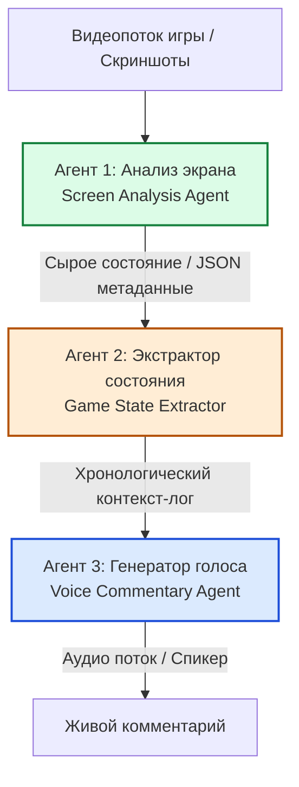

# Архитектурный разбор: Автономный игровой комментатор GameBuddy (Google Jules & Antigravity)

Этот документ содержит глубокий технический разбор архитектуры многоагентной системы комментирования геймплея в реальном времени **GameBuddy**, построенной на базе фреймворков **Google Jules** и **Antigravity 2.0**.

---

## 🎯 Концепция и назначение GameBuddy

**GameBuddy** — это автономная интеллектуальная система, способная в режиме реального времени анализировать видеопоток игрового процесса, формировать хронологическую базу событий (игровое состояние), синтезировать живую речь комментатора с учетом игрового контекста, эмоций и стиля и озвучивать происходящее без задержек.

Проект является эталоном интеграции распределенного ИИ в ресурсоемких мультимедийных средах.

---

## 🏗️ Многоагентная архитектура системы

Для разделения ответственности и минимизации задержек GameBuddy разделен на три специализированных сервисных слоя, управляемых отдельными субагентами:

### 1. Агент анализа экрана (Screen Analysis Agent)
Выполняет непрерывный захват кадров (screen scraping) с частотой 2-5 кадров в секунду. 
- Распознает элементы интерфейса (полоса здоровья, счет, мини-карта, инвентарь) с помощью легковесных локальных сверточных нейросетей (CNN) или быстрых Vision API-запросов к Gemini.
- Выдает структурированные метаданные кадра (например: `{ "hp": 85, "enemies_on_screen": 2, "active_weapon": "laser_rifle" }`).

### 2. Экстрактор состояния (Game State Extractor)
Аккумулирует метаданные кадров во временной лог-памяти и формирует связную хронологию событий.
- Группирует сырые изменения в логические транзакции (например: *"Игрок получил урон в размере 15 HP от выстрела сзади, количество патронов снизилось до нуля"*).
- Отсекает дублирующий шум, чтобы сэкономить контекстное окно (Karpathy Context Method).

### 3. Генератор комментариев и голоса (Voice Commentary Agent)
На основе хронологического лога событий синтезирует эмоциональный текст комментария.
- Адаптирует стиль речи (спортивный, аналитический, юмористический) под текущий темп игры.
- Передает текстовый payload в локальный синтезатор речи (TTS) для воспроизведения.

---

## ⚡ Оптимизация задержек и управление бюджетом

При проектировании real-time ИИ-систем критически важно решать две ключевые инженерные проблемы:

### 1. Сетевая задержка (Network Latency)
Для удержания задержки в пределах **100-200 мс** GameBuddy использует:
- Асинхронные сокеты (`FastAPI WebSockets`) для мгновенной передачи кадров и стейта между агентами.
- Сжатие данных и бинарный протокол обмена.

### 2. Контроль расхода токенов Gemini (Регламент 20%)
В соответствии со строгими правилами Pixel Office, GameBuddy подчиняется **Token Budget Control Protocol**:
- Оркестратор в реальном времени считает расход токенов.
- При приближении остатка лимита к **20%**, система переводит генераторы в экономичный режим (локальное кэширование и маршрутизация простых фраз, временная приостановка Vision-запросов высокой плотности) во избежание внезапного отключения комментатора посреди матча.
