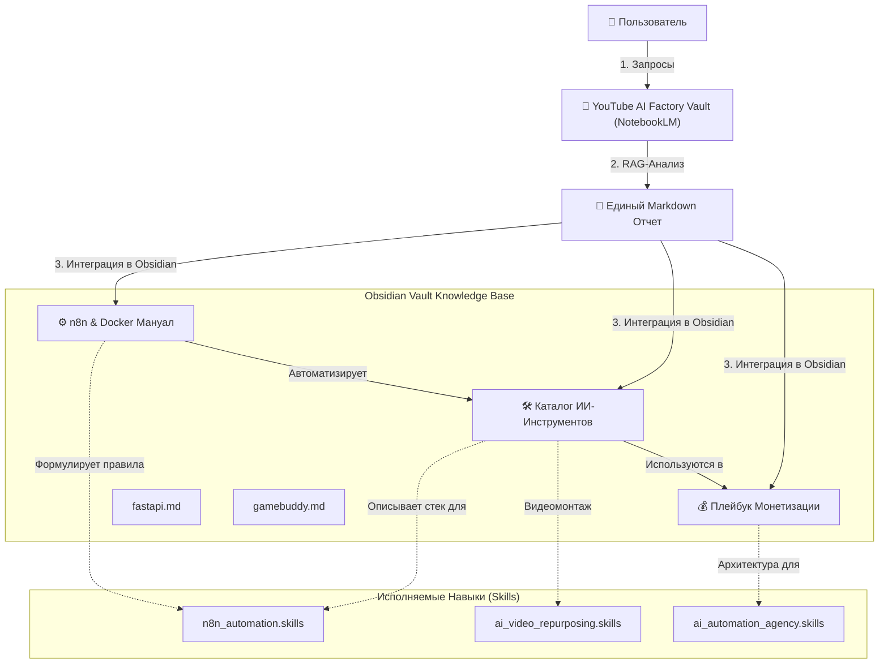

# 🌀 Карта Знаний: Фабрика ИИ-Контента

```mermaid
graph TD
    User["👤 Пользователь"] -->|1. Запросы| MainNB["🧠 YouTube AI Factory Vault (NotebookLM)"]
    MainNB -->|2. RAG-Анализ| RAG["📄 Единый Markdown Отчет"]
    
    RAG -->|3. Интеграция в Obsidian| Tools["🛠️ Каталог ИИ-Инструментов"]
    RAG -->|3. Интеграция в Obsidian| Manual["⚙️ n8n & Docker Мануал"]
    RAG -->|3. Интеграция в Obsidian| Playbook["💰 Плейбук Монетизации"]
    
    Tools -->|Используются в| Playbook
    Manual -->|Автоматизирует| Tools
    
    subgraph "Obsidian Vault Knowledge Base"
        Tools
        Manual
        Playbook
        F["fastapi.md"]
        G["gamebuddy.md"]
    end
    
    subgraph "Исполняемые Навыки (Skills)"
        NS["n8n_automation.skills"]
        AVS["ai_video_repurposing.skills"]
        AA["ai_automation_agency.skills"]
    end
    
    Tools -.->|Описывает стек для| NS
    Manual -.->|Формулирует правила| NS
    Playbook -.->|Архитектура для| AA
    Tools -.->|Видеомонтаж| AVS
```
